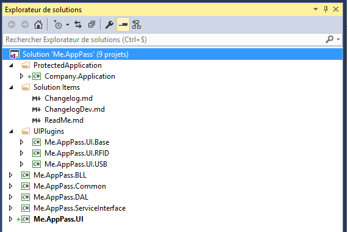
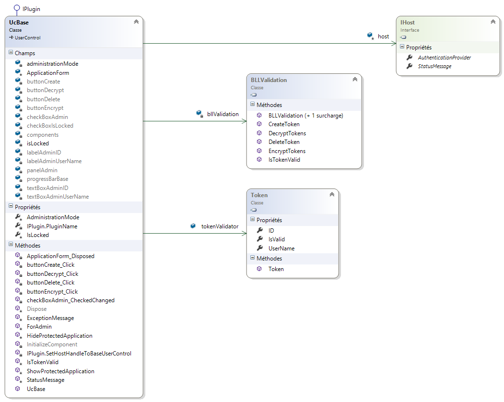
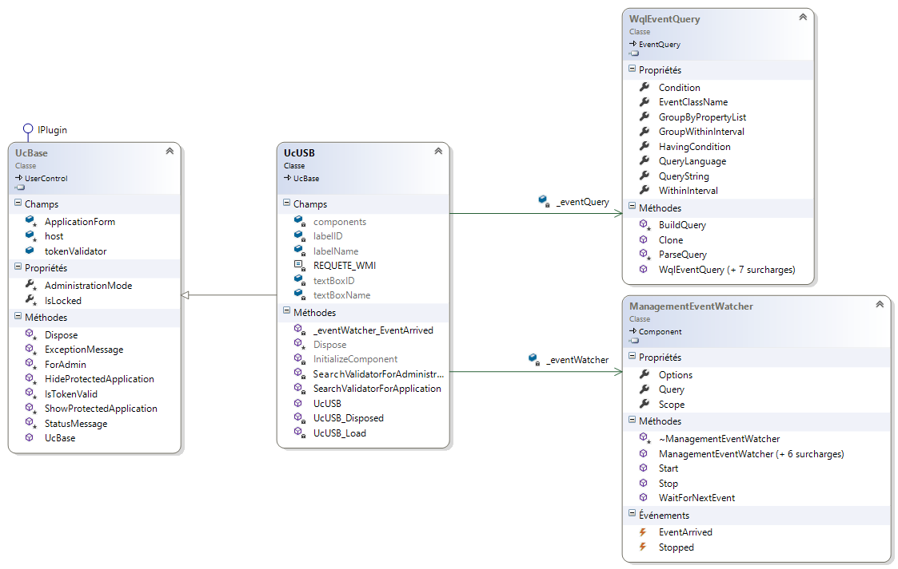
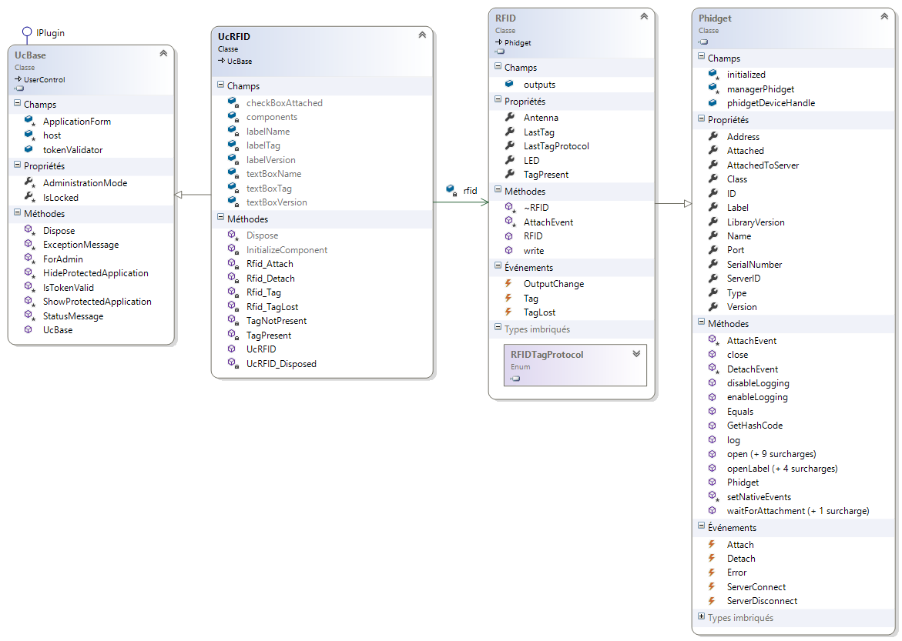
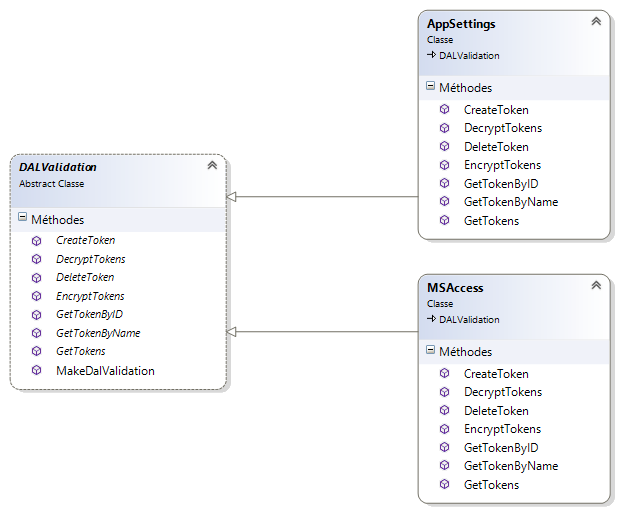
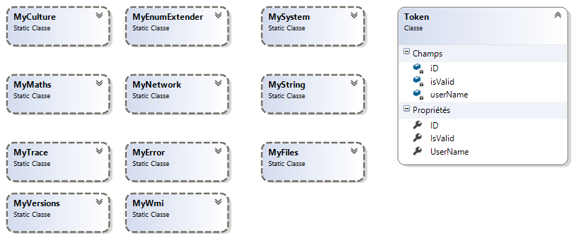

# Me.AppPass - LisezMoi

L'objectif de la solution est de sécuriser l'accès à une application WinForm intégrée à cette solution.

L'utilisateur connecté au système doit s'authentifier auprès de l'application pour pouvoir l'utiliser. Dans la version actuelle (v1.0.0.0) ce dernier a le choix entre une authentification par puce RFID ou une clé USB (validateur).

L'administrateur de l'application aura au préalable enregistré sur un support physique les informations permettant cette authentification (Token : Nom utilisateur, ID). La nature de l’ID dépend du choix du validateur, dans le cas de la clé USB c’est l’identifiant unique de la clef, dans le cas RFID c’est l’ID d’un tag présenté à l’antenne de la carte RFID.

Si le validateur est débranché du système alors que l’application est en cours d’utilisation, cette dernière devient inaccessible tant que le validateur n’aura pas été rebranché. La fenêtre d’authentification est affichée si aucun validateur correct n’est connecté ou si comme dit précédemment le validateur a été déconnecté.

La solution a été conçu pour être facilement extensible, aussi bien qu’en au choix du validateur que du lieu de stockage des Tokens.

L’architecture utilisée est une architecture 3 tiers classique : couche interface utilisateur, couche métier, couche d’accès aux données et couche service interface.

 
## Couche interface utilisateur :

Elle est implémentée sous forme de UserControls chargés dans une WinForm (cf. Validateur).
 

« UcHost » étant le UserControl parent
 
## Couche métier :

Elle est réduite au minimum, et n’est présente que pour une évolution éventuelle du produit. Dans l’état actuel du projet (v1.0.0.0), elle n’a pratiquement qu’une fonction de passerelle entre les couches UI et DAL.

 
## Couche accès aux données :

Elle est écrite pour permettre à l’application d’être évolutive. Elle est constituée d’une classe abstraite (DALValidation), n’implémentant que les méthodes qui sont communes à toutes les DAL. Les classes concrètes DAL (DalAppSettings, DALMsAccess…) dérivent de cette classe abstraite et implémentent les méthodes spécifiques au type de support. Ces méthodes de type abstrait, sont déclarées dans la classe abstraite.

 
## Couche service interface

Le service interface propose deux classes Interface :

* IPlugin : qui doit être implémenté par les UserControls de la couche UI
* IHost : qui est implémenté par le UserControl « UcHost » (Contrôle parent des UserControls concrets).

Ce dernier permet aux UserControls enfants d’accéder à ses contrôles, notamment le contrôle StatusStrip par le biais de StatusMessage.

La classe « ServicePlugin » permet la récupération des plugins et la création d’instance du plugin que l’utilisateur aura sélectionné.
 
## Modèle de données

L’application utilise un jeton « Token » pour l’authentification. Il est renseigné en partie par la couche UI, et validé par la couche BLL « IsValid ».
 
## Validateur :

L’interface logiciel du validateur a été implémenté sous forme de plugins de type UserControls. Un UseControl pilotant un validateur matériel doit dériver du contrôle de base UcBase.

 
## Stockage

Les classes concrètes de stockage dérivent de la classe abstraite « DALValidation ». On peut donc étendre à volonté ce lieu de stockage. Dans la version actuelle (v1.0.0.0) seul « AppSettings » est implémenté.
La DAL expose à la BLL une méthode statique de fabrication de DAL :
~~~ C#
public static DALValidation MakeDalValidation(string dalAssemblyName, string dalType)
~~~
La BLL doit passer en paramètre, le nom de la DAL (Me.AppPass.DAL) ainsi que le type de DAL à créer (ex : AppSettings). Ces paramètres sont définis dans « App. Config » (clés : DalAssemblyName et DalType).

Dans son implémentation, la DAL « AppSettings » utilise le provider « DataProtectionConfigurationProvider » pour le cryptage de la section appSettings.

~~~ XML
  <appSettings>
    <add key="DalAssemblyName" value="Me.AppPass.DAL"/>
    <add key="DalType" value="AppSettings"/>
    <!--AppSettings - MsAccess ...-->
    <add key="jow" value="REV_5.00\0C0706006395"/>
    <add key="jow1" value="010238a53e"/>
    <add key="btsiris" value="REV_8.02\0266711AE8111C8C"/>
  </appSettings>

  <appSettings configProtectionProvider="DataProtectionConfigurationProvider">
    <EncryptedData>
      <CipherData>
        <CipherValue>AQAAANCMnd8BFdERjHoAwE/ ..... ==</CipherValue>
      </CipherData>
    </EncryptedData>
  </appSettings>
~~~