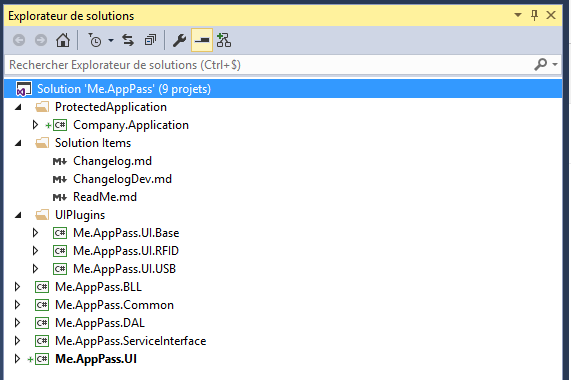
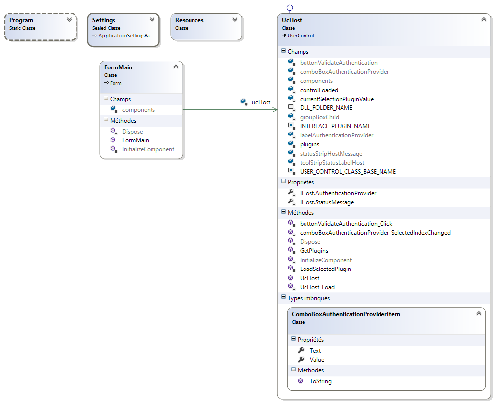
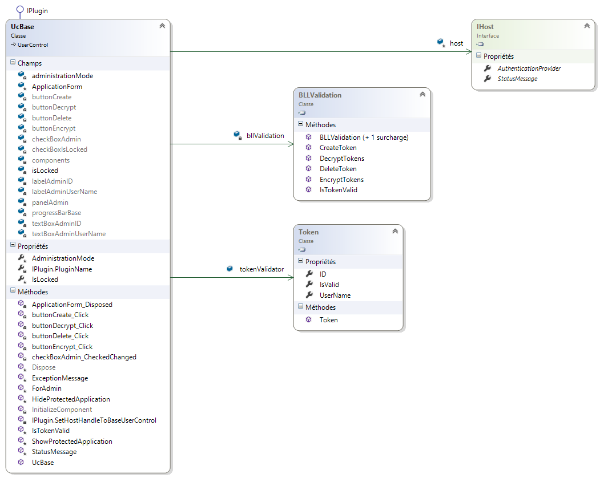
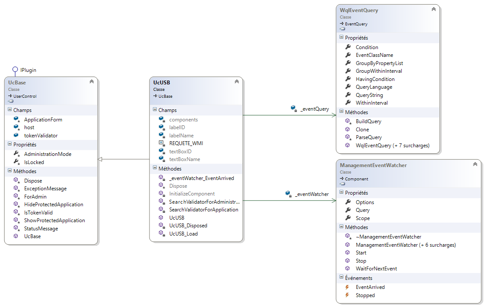
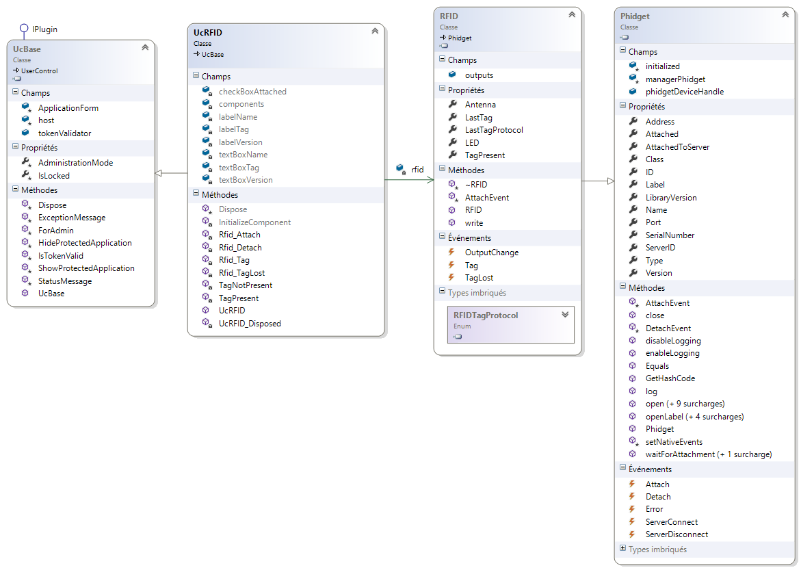
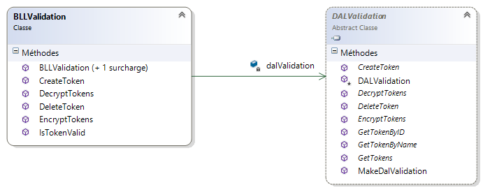
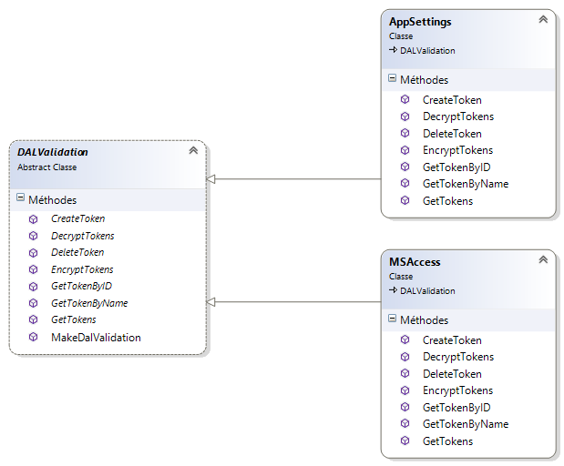
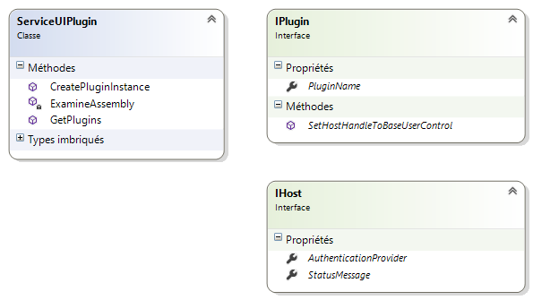
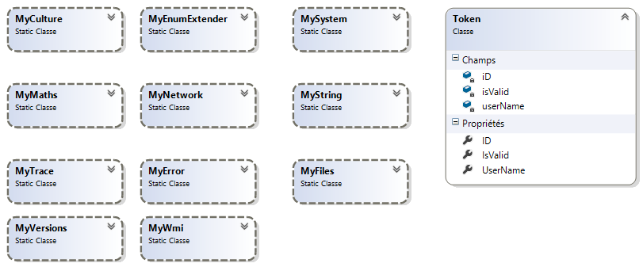

# Me.AppPass - ReadMe

The objective of the solution is to make safe the access to a WinForm application integrated into this solution.

The user connected to the system must authenticate himself near the application to be able to use it. The current version (v 1.0.0.0) this last A the choice enters an authentification by chip RFID or a key USB (validator).

The administrator of the application will as a preliminary have recorded on a physical support information allowing this authentification (Token: Name user, ID). The nature of the ID depends on the choice of the validator, in the case of key USB it is the single identifier of the key, in case RFID it is the ID of a tag presented at the antenna of chart RFID.

If the validator is disconnected system whereas the application is in the course of use, the latter becomes inaccessible as long as the validator will not have been replugged. The window of authentification is posted if no correct validator is connected or if like known as previously the validator were disconnected.

The solution was conceived to be easily extensible, as well as in with the choice of the validator as of the place of storage of Tokens.

Architecture used is a traditional architecture 3 thirds: sleep user interface, trade layer, layer of access to the data and service layer interfaces.

 
## User interface layer :

It is implemented in the form of UserControls charged in WinForm (cf. Validator).

 

« UcHost » étant le UserControl parent
 
## Business layer :

It is to the minimum reduced, and is present only for one possible evolution of the product. In the current state of the project (v 1.0.0.0), it has practically only one function of footbridge between layers UI and DAL.

 
## Data access layer :

It is written to make it possible the application to be evolutionary. It consists of an abstract class (DALValidation), implementing only the methods which are common to all the DAL. Concrete classes DAL (DalAppSettings, DALMsAccess…) derive from this abstract class and implement the methods specific to the type of support. These methods of abstract type, are declared in the abstract class.

 
## Interface service layer :

The service interface proposes two Interface classes:

* IPlugin: who must be implemented by UserControls of layer UI
* IHost: who is implemented by UserControl “UcHost” (Control relative of UserControls concrete).

This last makes it possible UserControls children to reach its controls, in particular StatusStrip control by the means of StatusMessage.

The class “ServicePlugin” allows the recovery of the plugins and the creation of authority of the plugin that the user will have selected.
 
## Data model :

The application uses a token “Token” for the authentification. It is partly indicated by layer UI, and validated by layer BLL “IsValid”.
 
## Validator :

The interface software of the validator was implemented in the form of plugins of the UserControls type. UseControl controlling a material validator must derive from basic control UcBase.

 
## Storage : 

The concrete classes of storage derive from the abstract class “DALValidation”. One can thus extend this place of storage at will. Dans la version actuelle (v1.0.0.0) seul « AppSettings » est implémenté.
The DAL exposes the BLL a static method for manufacturing DAL:
~~~ C#
public static DALValidation MakeDalValidation(string dalAssemblyName, string dalType)
~~~
The BLL must pass a parameter, the name of the DAL (Me.AppPass.DAL) and the type of DAL to create (eg AppSettings).
These parameters are defined in "App. Config "(key: DalAssemblyName and DalType).

In its implementation, the DAL "AppSettings" uses the provider "DataProtectionConfigurationProvider" for encrypting the appSettings section.
~~~ XML
  <appSettings>
    <add key="DalAssemblyName" value="Me.AppPass.DAL"/>
    <add key="DalType" value="AppSettings"/>
    <!--AppSettings - MsAccess ...-->
    <add key="jow" value="REV_5.00\0C0706006395"/>
    <add key="jow1" value="010238a53e"/>
    <add key="btsiris" value="REV_8.02\0266711AE8111C8C"/>
  </appSettings>

  <appSettings configProtectionProvider="DataProtectionConfigurationProvider">
    <EncryptedData>
      <CipherData>
        <CipherValue>AQAAANCMnd8BFdERjHoAwE/ ..... ==</CipherValue>
      </CipherData>
    </EncryptedData>
  </appSettings>
~~~

[French to english translation](http://www.worldlingo.com)